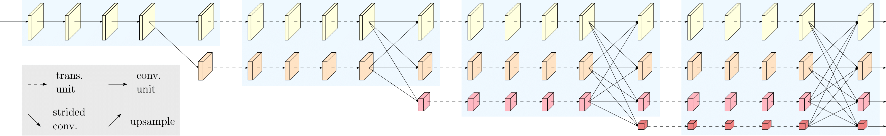
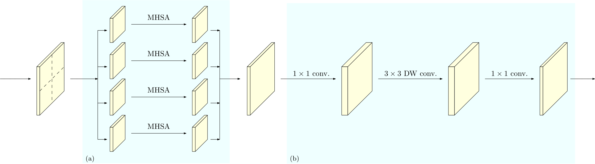

# HRFormer: High-Resolution Transformer for Dense Prediction, NeurIPS 2021


## Introduction
This is the official implementation of [High-Resolution Transformer (HRFormer)](https://arxiv.org/pdf/2110.09408.pdf). We present a High-Resolution Transformer (HRFormer) that learns high-resolution representations for dense prediction tasks, in contrast to the original Vision Transformer that produces low-resolution representations and has high memory and computational cost. We take advantage of the multi-resolution parallel design introduced in high-resolution convolutional networks (HRNet), along with local-window self-attention that performs self-attention over small non-overlapping image windows, for improving the memory and computation efficiency. In addition, we introduce a convolution into the FFN to exchange information across the disconnected image windows. We demonstrate the effectiveness of the High-Resolution Transformer on human pose estimation and semantic segmentation tasks.

- The HRFormer architecture:



- The HRFormer Unit (trans. unit):




## Pose estimation

### 2d Human Pose Estimation

#### Results on COCO `val2017` with detector having human AP of 56.4 on COCO `val2017` dataset

| Backbone  | Input Size | AP | AP<sup>50</sup> | AP<sup>75</sup> | AR<sup>M</sup> | AR<sup>L</sup> | AR | ckpt | log | script |
| :----------------- | :-----------: | :------: | :------: | :------: | :------:| :------: | :------: |:------: |:------: | :------: |
| HRFormer-S  | 256x192 | 74.0% | 90.2% | 81.2% | 70.4% | 80.7% | 79.4% | [ckpt](https://1drv.ms/u/s!Ai-PFrdirDvwj2PC53KZd-7v3X0H?e=hUZ0fE) | [log](https://1drv.ms/u/s!Ai-PFrdirDvwj2Bytw64p9XJuYMt?e=Fj8brM) | [script](./pose/configs/top_down/hrt/coco/hrt_small_coco_256x192.py) |
| HRFormer-S  | 384x288 | 75.6% | 90.3% | 82.2% | 71.6% | 82.5% | 80.7% | [ckpt](https://1drv.ms/u/s!Ai-PFrdirDvwj2TxlkzWYuh9CkvU?e=H50XSl) | [log](https://1drv.ms/u/s!Ai-PFrdirDvwj2FjbD4E7EQi-2n5?e=8xJqCD) | [script](./pose/configs/top_down/hrt/coco/hrt_small_coco_384x288.py) |
| HRFormer-B  | 256x192 | 75.6% | 90.8% | 82.8% | 71.7% | 82.6% | 80.8% | [ckpt](https://1drv.ms/u/s!Ai-PFrdirDvwj2V-4bLd_7RkjTFW?e=L20Wit) | [log](https://1drv.ms/u/s!Ai-PFrdirDvwj2KhySyLQ-QHUQ4l?e=FEKmfr) | [script](./pose/configs/top_down/hrt/coco/hrt_base_coco_256x192.py) |
| HRFormer-B  | 384x288 | 77.2% | 91.0% | 83.6% | 73.2% | 84.2% | 82.0% | [ckpt](https://1drv.ms/u/s!Ai-PFrdirDvwj2ZKrF6rWWzoRJUM?e=RCRb0p) | [log](https://1drv.ms/u/s!Ai-PFrdirDvwj100SWSwSYeZvXvL?e=Tu6Gtm) | [script](./pose/configs/top_down/hrt/coco/hrt_base_coco_384x288.py) |


#### Results on COCO `test-dev` with detector having human AP of 56.4 on COCO `val2017` dataset

| Backbone  | Input Size | AP | AP<sup>50</sup> | AP<sup>75</sup> | AR<sup>M</sup> | AR<sup>L</sup> | AR | ckpt | log | script |
| :----------------- | :-----------: | :------: | :------: | :------: | :------:| :------: | :------: |:------: |:------: | :------: |
| HRFormer-S  | 384x288 | 74.5% | 92.3% | 82.1% | 70.7% | 80.6% | 79.8% | [ckpt](https://1drv.ms/u/s!Ai-PFrdirDvwj2TxlkzWYuh9CkvU?e=H50XSl) | [log](https://1drv.ms/u/s!Ai-PFrdirDvwj2FjbD4E7EQi-2n5?e=8xJqCD) |  [script](./pose/configs/top_down/hrt/coco/hrt_small_coco_384x288.py) |
| HRFormer-B  | 384x288 | 76.2% | 92.7% | 83.8% | 72.5% | 82.3% | 81.2% | [ckpt](https://1drv.ms/u/s!Ai-PFrdirDvwj2ZKrF6rWWzoRJUM?e=RCRb0p) | [log](https://1drv.ms/u/s!Ai-PFrdirDvwj100SWSwSYeZvXvL?e=Tu6Gtm) |  [script](./pose/configs/top_down/hrt/coco/hrt_base_coco_384x288.py)  |

The models are first pre-trained on ImageNet-1K dataset, and then fine-tuned on COCO `val2017` dataset.


## Semantic segmentation


#### Cityscapes
Performance on the Cityscapes dataset. The models are trained and tested with input size of 512x1024 and 1024x2048 respectively. 

Methods | Backbone | Window Size | Train Set | Test Set | Iterations | Batch Size | OHEM | mIoU | mIoU (Multi-Scale) | Log | ckpt | script |
| :---- | :------- | :---: | :--: | :--: | :--: | :--: | :--: | :--: | :--: | :--: | :--: |:--: |
OCRNet | HRFormer-S | 7x7 | Train | Val | 80000 | 8 | Yes | 80.0 | 81.0 | [log](https://1drv.ms/u/s!Ai-PFrdirDvwj3K-rPMQ6sHNV-Fe?e=D3IbNn) | [ckpt](https://1drv.ms/u/s!Ai-PFrdirDvwj3Wsg-_ApKUAEUft?e=BnhLal) | [script](./seg/scripts/cityscapes/hrt/run_hrt_small_ocr_v2_ohem.sh) |
OCRNet | HRFormer-B | 7x7 | Train | Val | 80000 | 8 | Yes | 81.4 | 82.0 | [log](https://1drv.ms/u/s!Ai-PFrdirDvwj3NtH1LBB0w6yCO3?e=p4v29Z) | [ckpt](https://1drv.ms/u/s!Ai-PFrdirDvwj3zEMdYLM8nZ5gXN?e=v7ehnB) |[script](./seg/scripts/cityscapes/hrt/run_hrt_base_ocr_v2_ohem.sh) |
OCRNet | HRFormer-B | 15x15 | Train | Val | 80000 | 8 | Yes | 81.9 | 82.6 | [log](https://1drv.ms/u/s!Ai-PFrdirDvwkAlyBb4tGcxSjF_A?e=diIDCV) | [ckpt](https://1drv.ms/u/s!Ai-PFrdirDvwkAp3LjwI-7Csmh0K?e=K1zXrn)|[script](./seg/scripts/cityscapes/hrt/run_hrt_base_ocr_v2_ohem_w15.sh) | 

#### PASCAL-Context

The models are trained with the input size of 520x520, and tested with original size.

Methods | Backbone | Window Size | Train Set | Test Set | Iterations | Batch Size | OHEM | mIoU | mIoU (Multi-Scale) | Log | ckpt | script |
| :---- | :------- | :---: | :--: | :--: | :--: | :--: | :--: | :--: | :--: | :--: | :--: |:--: |
OCRNet | HRFormer-S | 7x7 | Train | Val | 60000 | 16 | Yes | 53.8 | 54.6 | [log](https://1drv.ms/u/s!Ai-PFrdirDvwj306lzvnI4s5U43l?e=J9mCfg) | [ckpt](https://1drv.ms/u/s!Ai-PFrdirDvwkADkevlhIuUrPC1T?e=hcDx5S) | [script](./seg/scripts/pascal_context/hrt/run_hrt_small_ocr_v2_ohem.sh) |
OCRNet | HRFormer-B | 7x7 | Train | Val | 60000 | 16 | Yes | 56.3 | 57.1 | [log](https://1drv.ms/u/s!Ai-PFrdirDvwj3_0tiJZqL7HWPv1?e=6ilX0Z) | [ckpt](https://1drv.ms/u/s!Ai-PFrdirDvwkAMUzRnCGmAxEehJ?e=HrCQ9c) |[script](./seg/scripts/pascal_context/hrt/run_hrt_base_ocr_v2_ohem.sh) |
OCRNet | HRFormer-B | 15x15 | Train | Val | 60000 | 16 | Yes | 57.6 | 58.5 | [log](https://1drv.ms/u/s!Ai-PFrdirDvwj3kphBj2FusLylDg?e=qZSrpp) | [ckpt](https://1drv.ms/u/s!Ai-PFrdirDvwkAIBAkrOlPp_T1YT?e=DeHMdo)|[script](./seg/scripts/pascal_context/hrt/run_hrt_base_ocr_v2_ohem_w15.sh) | 

#### COCO-Stuff

The models are trained with input size of 520x520, and tested with original size.

Methods | Backbone | Window Size | Train Set | Test Set | Iterations | Batch Size | OHEM | mIoU | mIoU (Multi-Scale) | Log | ckpt | script |
| :---- | :------- | :---: | :--: | :--: | :--: | :--: | :--: | :--: | :--: | :--: | :--: |:--: |
OCRNet | HRFormer-S | 7x7 | Train | Val | 60000 | 16 | Yes | 37.9 | 38.9 | [log](https://1drv.ms/u/s!Ai-PFrdirDvwj3ayL8oHrwsjRP1U?e=uOa0NC) | [ckpt](https://1drv.ms/u/s!Ai-PFrdirDvwj3tbt5BhdCrsu6lK?e=up2HUI) | [script](./seg/scripts/coco_stuff/hrt/run_hrt_small_ocr_v2_ohem.sh) |
OCRNet | HRFormer-B | 7x7 | Train | Val | 60000 | 16 | Yes | 41.6 | 42.5 | [log](https://1drv.ms/u/s!Ai-PFrdirDvwj3iKM2xyDk-6jnJd?e=HL5s7d) | [ckpt](https://1drv.ms/u/s!Ai-PFrdirDvwkAFAYKZm2wL9C6KL?e=AZiXLK) |[script](./seg/scripts/coco_stuff/hrt/run_hrt_base_ocr_v2_ohem.sh) |
OCRNet | HRFormer-B | 15x15 | Train | Val | 60000 | 16 | Yes | 42.4 | 43.3 | [log](https://1drv.ms/u/s!Ai-PFrdirDvwj3RtsUasPSb4nhL_?e=WUBe74) | [ckpt](https://1drv.ms/u/s!Ai-PFrdirDvwj37Np48Gpb-Pjowu?e=iwL5UA)|[script](./seg/scripts/coco_stuff/hrt/run_hrt_base_ocr_v2_ohem_w15.sh) |  

#### ADE20K

The models are trained with input size of 520x520, and tested with original size. The results with window size 15x15 will be updated latter.

Methods | Backbone | Window Size | Train Set | Test Set | Iterations | Batch Size | OHEM | mIoU | mIoU (Multi-Scale) | Log | ckpt | script |
| :---- | :------- | :---: | :--: | :--: | :--: | :--: | :--: | :--: | :--: | :--: | :--: |:--: |
OCRNet | HRFormer-S | 7x7 | Train | Val | 150000 | 8 | Yes | 44.0 | 45.1 | [log](https://1drv.ms/u/s!Ai-PFrdirDvwj3EehoEZZUDMX0NU?e=F8HAQi) | [ckpt](https://1drv.ms/u/s!Ai-PFrdirDvwj28i74aN6_Zk4clX?e=CWGOcd) | [script](./seg/scripts/ade20k/hrt/run_hrt_small_ocr_v2_ohem.sh) |
OCRNet | HRFormer-B | 7x7 | Train | Val | 150000 | 8 | Yes | 46.3 | 47.6 | [log](https://1drv.ms/u/s!Ai-PFrdirDvwj265qyyZ74PKjfqm?e=Cj7TGl) | [ckpt](https://1drv.ms/u/s!Ai-PFrdirDvwj3epNJ-QFF33tZtr?e=df3fQk) |[script](./seg/scripts/ade20k/hrt/run_hrt_base_ocr_v2_ohem.sh) |
OCRNet | HRFormer-B | 13x13 | Train | Val | 150000 | 8 | Yes | 48.7 | 50.0 | [log](https://1drv.ms/u/s!Ai-PFrdirDvwkAjmpl5jj0sXz2v-?e=sfhyI4) | [ckpt](https://1drv.ms/u/s!Ai-PFrdirDvwj3oTs_gVPzFDjdyU?e=yjGRKz)|[script](./seg/scripts/ade20k/hrt/run_hrt_base_ocr_v2_ohem_w13.sh) | 
OCRNet | HRFormer-B | 15x15 | Train | Val | 150000 | 8 | Yes | - | - | - | - | - | 


## Classification


#### Results on ImageNet-1K

| Backbone | acc@1 | acc@5 | #params | FLOPs | ckpt | log | script |
| :--: | :--: | :--: | :--: | :--: | :--: | :--: | :--: |
| HRFormer-T | 78.6% | 94.2% | 8.0M | 1.83G |[ckpt](https://1drv.ms/u/s!Ai-PFrdirDvwj1UXGB63dBVVOuLO?e=ZLOY7r) | [log](https://1drv.ms/t/s!Ai-PFrdirDvwj1S0MH9FzWCwzzxE?e=6p1Q3X) | [script](./cls/configs/hrt/hrt_tiny.yaml)
| HRFormer-S | 81.2% | 95.6% | 13.5M | 3.56G |[ckpt](https://1drv.ms/u/s!Ai-PFrdirDvwj1cc3tSp4kIKI_JH?e=bHW7xj) | [log](https://1drv.ms/t/s!Ai-PFrdirDvwj1l2RxNkcb6lmGF3?e=hZ9A1K) | [script](./cls/configs/hrt/hrt_small.yaml)
| HRFormer-B | 82.8% | 96.3% | 50.3M | 13.71G |[ckpt](https://1drv.ms/u/s!Ai-PFrdirDvwj1iNZngTF7PEyik9?e=fv8CG6) | [log](https://1drv.ms/t/s!Ai-PFrdirDvwj1aBKjc1mKQCkwen?e=spYZOe) | [script](./cls/configs/hrt/hrt_base.yaml) |


## Citation

If you find this project useful in your research, please consider cite:

```
@article{YuanFHLZCW21,
  title={HRFormer: High-Resolution Transformer for Dense Prediction},
  author={Yuhui Yuan and Rao Fu and Lang Huang and Weihong Lin and Chao Zhang and Xilin Chen and Jingdong Wang},
  booktitle={NeurIPS},
  year={2021}
}
```


## Acknowledgment
This project is developed based on the [Swin-Transformer](https://github.com/microsoft/Swin-Transformer), [openseg.pytorch](https://github.com/openseg-group/openseg.pytorch), and [mmpose](https://github.com/open-mmlab/mmpose).


```
git diff-index HEAD
git subtree add -P pose <url to sub-repo> <sub-repo branch>
```
